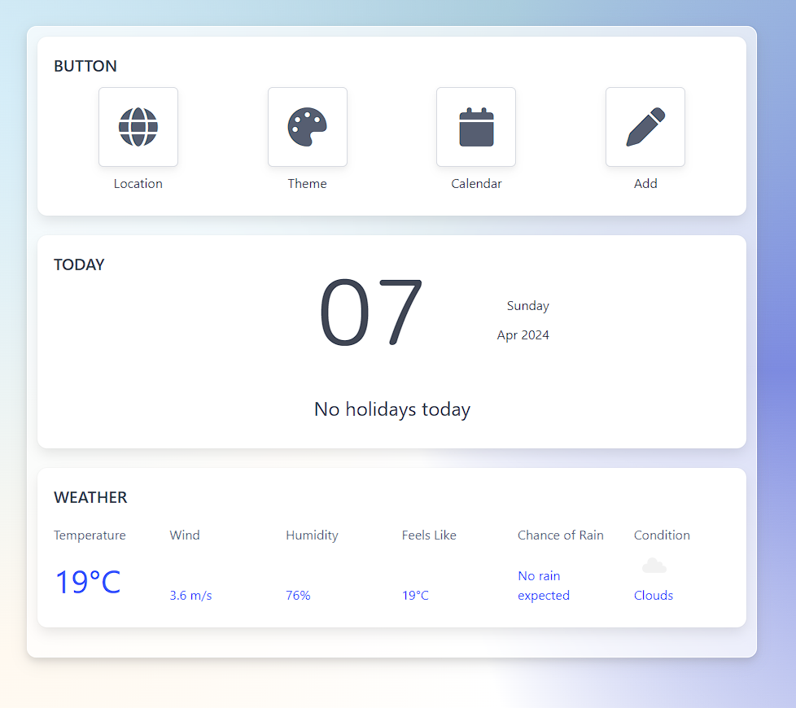
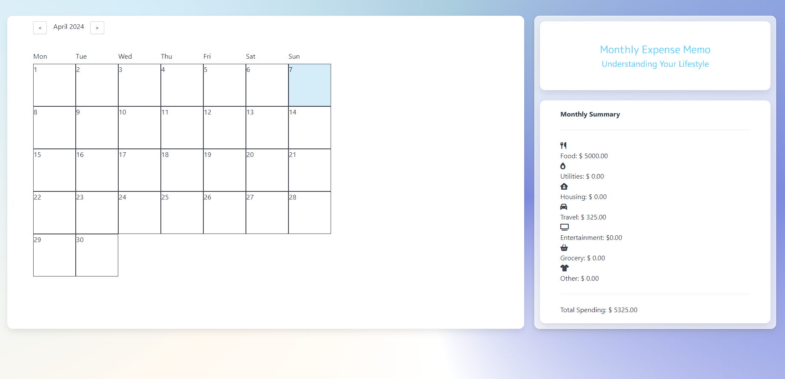

# Budget Memo

## Introduction

This application is a monthly budget tracker that also tracks weather and public holidays.
It retrieves data from third-party APIs https://openweathermap.org and https://calendarific.com, and displays data with dynamically updated HTML and CSS.

Presentation: https://docs.google.com/presentation/d/1X7UIdFxIAkcK7YhHGt-TteMTZQ7MVEdSoqox9XUs-1g/edit#slide=id.p

## User Story

As a household I want to track my spending so that I don’t go broke.

## Acceptance Criteria

WHEN I open the webpage 
THEN I see today's date, weather, and if it’s a public holiday

WHEN I click on a button 
THEN I have a form where I can submit my daily spending

WHEN I add the spending for the day 
THEN I get taken to a monthly calendar

WHEN I look at the monthly calendar page 
THEN I can see how much I have spent each day

WHEN I look at the monthly calendar page 
THEN I can see my total spent for the month


## File Structure
```md
budget-memo
├── assets
│   ├── css
│   │   ├── calendar.css
│   │   └── landing.css
│   │
│   └── js
│       ├── calendar.js
│       ├── landing.js
│       └── logic.js
├── calendar.html
├── index.html
└── README.md
```

## Deploy

* The URL of the deployed application:  https://lukehunter1991.github.io/Budget-Memo/

* The URL of the GitHub repository: https://github.com/LukeHunter1991/Budget-Memo


## Usage

Starting with the landing page, to get accurate weather data you will need to click the location buttion. Your browser will ask your permission to use your location. If you accept, the weather data will automatically update. You can swap between light/dark mode by clicking the theme button. The theme is saved to local storage and is persistent between the pages.

To add your exspenses for today you can click the add button to open the modal. You can select a category and input an amount. Click the 'Add Log' button to save each record. To see your monthly totals and your monthly calendar you can click the 'Calendar' button to be redirected.

On calendar.html the right panel shows your monthly exspenses for each category along with you can see your expenses that have been added for each day by hovering on the relevant days section on the calendar. You can clear existing exspense records or add exspense records for specific days using the calendar.






## Technologies Used
HTML

CSS

javaScript

jQuery

Bulma

Google Fonts


## Credits

Brian Brady https://github.com/bbrady00

Luke Hunter https://github.com/LukeHunter1991

Melody Yan https://github.com/MelodyYan96

Shuying Zhou https://github.com/Saraz-Git
